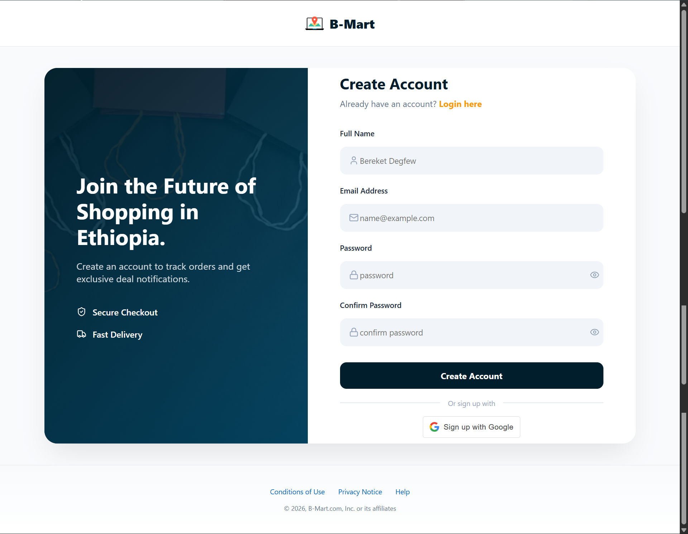
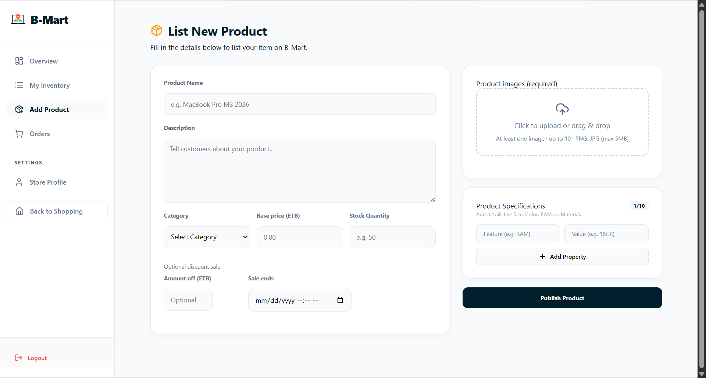

# Ecommerce Platform

A multi-role ecommerce platform with separate experiences for buyers, sellers, admins, and delivery personnel.

## Table of Contents

- [Overview](#overview)
- [Core Features](#core-features)
- [Tech Stack](#tech-stack)
- [Project Structure](#project-structure)
- [Screenshots](#screenshots)
- [Quick Start (Docker)](#quick-start-docker)
- [Local Development (Without Docker)](#local-development-without-docker)
- [Environment Variables](#environment-variables)
- [API Overview](#api-overview)
- [Database and Migrations](#database-and-migrations)
- [Scripts](#scripts)
- [Current Limitations](#current-limitations)
- [Contributing](#contributing)
- [License](#license)

## Overview

This project provides an end-to-end marketplace flow:

- Buyers browse products, manage cart/wishlist, and place orders.
- Sellers apply, manage inventory, track orders, and request payouts.
- Admins moderate marketplace operations, resolve disputes, and manage approvals.
- Delivery users manage assigned deliveries and payout-related operations.


## Core Features

- **Authentication**: email/password login and Google sign-in.
- **Storefront**: product listing, category discovery, search, product details.
- **Shopping flows**: cart, wishlist, checkout, order history.
- **Seller portal**: product CRUD, sales and inventory management, store profile.
- **Admin dashboard**: user/seller oversight, payout workflows, dispute handling.
- **Delivery dashboard**: order acceptance and delivery workflow support.

## Tech Stack

- **Frontend**: React, Vite, React Router, React Query, Axios
- **Backend**: Node.js, Express, Prisma ORM, PostgreSQL driver
- **Database**: PostgreSQL
- **Security/Validation**: Helmet, CORS, rate limiting, JWT, Zod
- **Integrations**: Chapa (payments), Cloudinary (media), Google OAuth
- **Containerization**: Docker + Docker Compose, Nginx (frontend serving)

## Project Structure

```
.
|-- docker-compose.yml
|-- README.Docker.md
|-- services/                # Express API + Prisma schema/migrations
|   |-- controllers/
|   |-- routes/
|   |-- middlewares/
|   `-- prisma/
|-- views/                   # React app (Vite)
|   |-- src/
|   `-- nginx.conf
`-- docs/
    `-- screenshots/         # UI screenshots
```

## Screenshots





### Prerequisites

- Docker Desktop (with Linux containers enabled)
- Docker Compose

### Steps

1. Configure backend environment values in `services/.env`.
2. Configure frontend environment values in `views/.env`.
3. Run:

```bash
docker compose up --build
```

### Service URLs


### Stop

```bash
docker compose down
```

## Local Development (Without Docker)

### Prerequisites

- Node.js 20+ recommended
- PostgreSQL 16+ (or compatible)

### 1) Backend

```bash
cd services
npm install
npx prisma migrate dev
npx prisma generate
node prisma/seed.js
npm run dev
```

### 2) Frontend

```bash
cd views
npm install
npm run dev
```

## Database and Migrations

- Prisma schema: `services/prisma/schema.prisma`
- Migrations: `services/prisma/migrations/`
- Seed script: `services/prisma/seed.js`

In containers, migrations run during backend startup (`prisma migrate deploy`).

## License

No license file is currently defined in the repository root. Add a `LICENSE` file to clarify usage and distribution terms.
